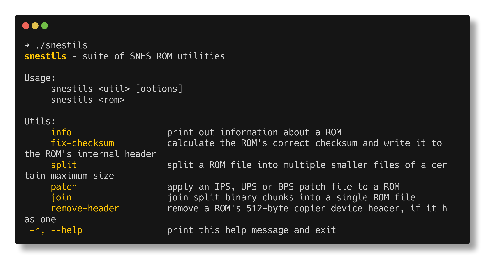

# snestils

A CLI that encompasses a suite of utilities for working with Super Nintendo/Super Famicom ROM files. I really wanted to just have one tool I use for all the different things you have to do to a ROM to make it runnable on real hardware. Nick from MouseBiteLabs has written [some great instructions on how to do so](https://mousebitelabs.com/2017/09/14/how-to-make-a-snes-reproduction-cartridge/), but it requires the use of at least four different (somewhat jank/sketchy) tools from the internet to do all the different things.

A rather ambitious goal for this program is to attain feature parity with ucon64, just the SNES-specific features. And keep in mind, ucon64 only supports IPS, APS and PPF patch formats, and not BPS or UPS.

For the time being, this project is licensed under the GNU General Public License v2.0 because I've borrowed some code (specifically, [`developer_ids.zon`](src/shared/developer_ids.zon)) from ucon64, which is under the same [license](https://ucon64.sourceforge.io/ucon64/license.html); it is a copyleft license and I don't know just how much copying you can do from one codebase to another before the latter becomes "derivative" of the former.

### Supported patch file types
- IPS
- UPS
- BPS

---

### Thanks to
- [SNESdev Wiki](https://snes.nesdev.org), particularly the pages:
  - [ROM header](https://snes.nesdev.org/wiki/ROM_header)
  - [ROM file formats](https://snes.nesdev.org/wiki/ROM_file_formats)
- [mousebitelabs.com](mousebitelabs.com)
- [ucon64](https://ucon64.sourceforge.io/)
- [Nocash's fullsnes documentation](https://problemkaputt.de/fullsnes.htm)
- [termshot](https://github.com/homeport/termshot) for the terminal screenshot
